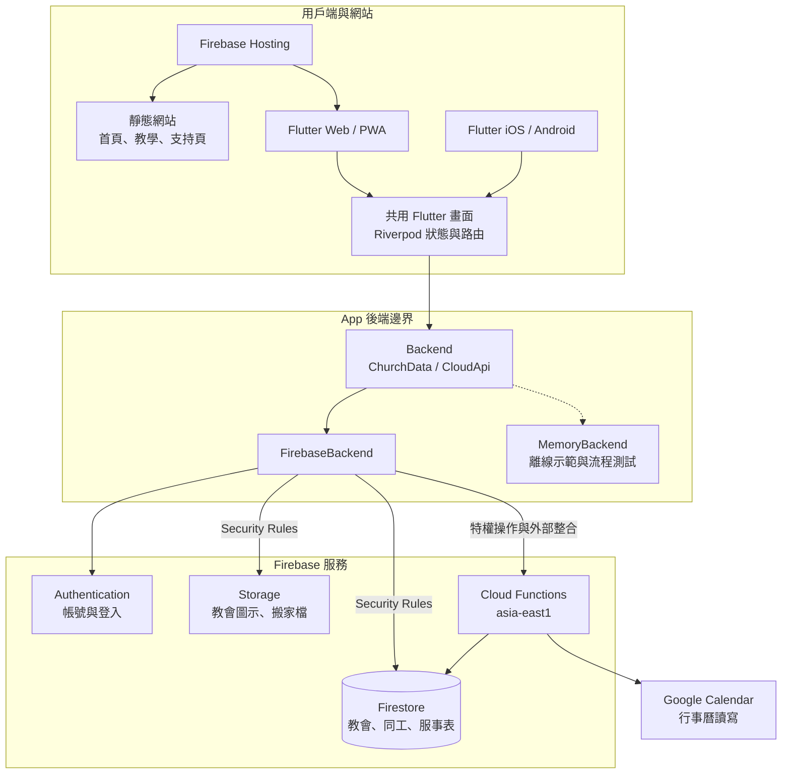
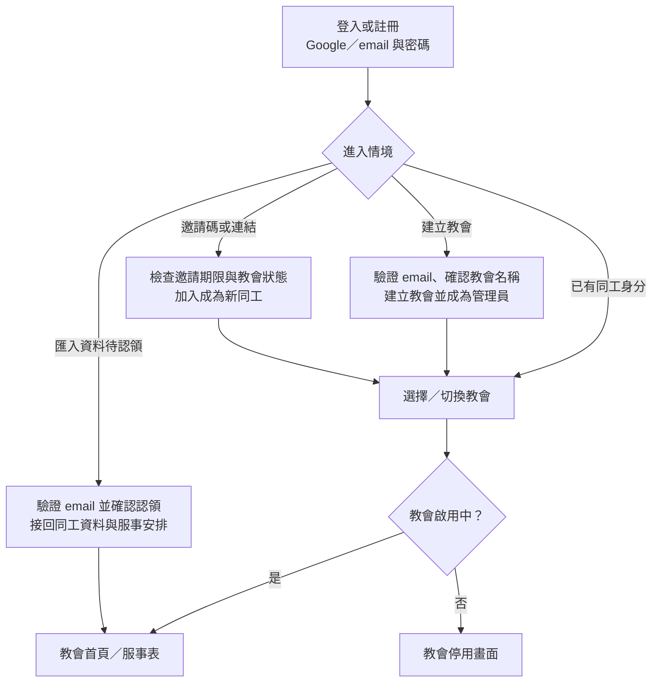
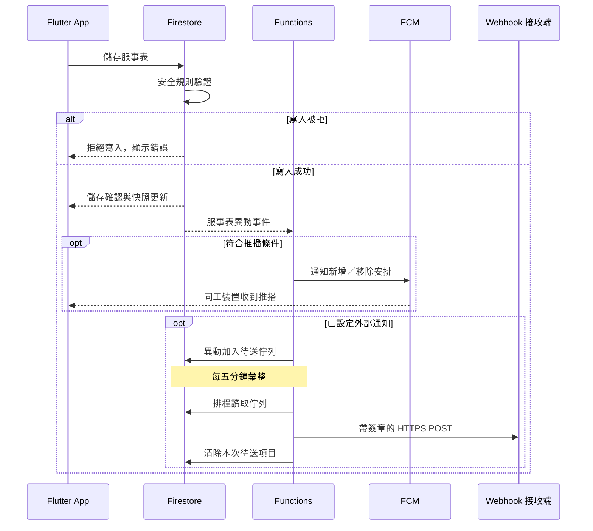

# 馬大別忙

多教會共用的同工服事表工具（代管版）。設計見 [`docs/design.md`](docs/design.md)，資料模型與權限見 [`docs/data-model.md`](docs/data-model.md)，專案建立見 [`docs/firebase-setup.md`](docs/firebase-setup.md)。

> 開發中。舊的自架版（church-staff-pwa）在其他分支，已凍結。

## 系統架構

同一個 Flutter App 支援 iOS、Android 與 Web，所有教會共用 Firebase 服務；資料與權限依教會隔離。以下是主要元件與存取路徑，虛線是示範與測試用的替代後端。



- **網站與 App 分開呈現**：`/` 是靜態首頁；App 路徑使用同一份 Flutter 網頁。`/c/<教會 id>` 由 `churchPage` 提供教會專屬名稱、圖示與 manifest，不是另外部署一個 App。
- **操作邊界**：目前教會內的操作走 `ChurchData`；建立／加入教會、帳號與營運者操作走 `CloudApi`。轉接層決定直接存取 Firestore，或呼叫 Cloud Functions。
- **授權在後端執行**：直接讀寫資料由 Firestore／Storage Security Rules 驗證；特權操作由 Functions 再檢查身分、教會狀態與權限。畫面的按鈕限制不能取代後端授權。
- **其他整合**：Functions 處理 FCM 推播、外部通知與照片辨識。Google Calendar 讀取共用快取，也支援有權限同工新增、修改與刪除活動；一般服事表不會自動匯出到 Google Calendar。

實作入口：[`backend.dart`](app/lib/data/backend.dart)、[`FirebaseBackend`](app/lib/data/firebase/firebase_backend.dart)、[`MemoryBackend`](app/lib/data/memory/memory_backend.dart)、[`Functions`](functions/src/index.ts)、[`Hosting 設定`](firebase.json)。

## 主要流程

### 登入、建立與加入教會

以下依進入情境簡化流程；教會／邀請連結會在登入後接續原本要去的地方。



- 建立教會與認領匯入資料需要已驗證的 email；邀請加入不要求 email 已驗證。
- 邀請加入與認領是兩件事：邀請建立新同工身分，不會自動接回匯入資料；認領需本人確認。已透過邀請加入的同工，也可以再合併待認領資料。
- 建立或透過邀請加入成功後，適用的手機瀏覽器會先顯示加入主畫面提示，再進入教會。名稱重複、邀請過期或其他檢查未通過時，會留在原步驟顯示錯誤。

實作入口：[`登入後導向`](app/lib/deep_link.dart)、[`建立教會`](functions/src/church.ts)、[`邀請`](functions/src/invites.ts)、[`認領`](functions/src/claim.ts)。

### 儲存服事表與通知

一般服事表由管理員，或有該牧區權限的 `roster-editors` 安排；活動的服事表由管理員或 `roster-editors` 安排，不限制牧區。儲存直接寫入 Firestore，不經過 callable Function。



- Firestore 會先反映本機變更，再等待伺服器確認；圖中只呈現確認後的主要路徑。其他同工的畫面也透過快照串流更新。
- 服事表異動推播不通知修改者或關閉通知的同工；匯入資料不發推播。推播是否送達仍取決於裝置權限與平台設定。
- 外部通知是選用整合，可由 n8n 等接收端轉送到 LINE；平台沒有內建 LINE 通知。服事表通知每五分鐘彙整，行事曆操作的通知則即時送出。
- 外部通知採盡力傳送，不重試；即使接收端失敗，本次待送項目仍會清除。

實作入口：[`服事表操作`](app/lib/state/roster_actions.dart)、[`安全規則`](firestore.rules)、[`異動推播`](functions/src/rosterChange.ts)、[`外部通知`](functions/src/webhook.ts)。

## 自己部署

代管版是唯一受支援的使用方式。程式碼採 MIT 公開，技術同工可以自己部署，但**不受支援**：沒有安裝精靈、沒有升級指引，問題請自行處理。要離開代管版，管理員可以在「教會資訊 → 匯出資料」下載全部資料。

想自己部署的話，起點在：

- `scripts/firebase-project.sh`：建立 Firebase 專案、開服務、寫 App 設定
- [`docs/firebase-setup.md`](docs/firebase-setup.md)：專案設定步驟與要手動完成的部分

## 結構

| 路徑 | 內容 |
| --- | --- |
| `app/` | Flutter App（iOS、Android、Web） |
| `functions/` | Cloud Functions（TypeScript，asia-east1） |
| `firestore.rules`、`storage.rules` | 安全規則，測試在 `firestore-tests/` |
| `landing/` | 網站：landing page、支持頁、教學文章（`blog/*.md`）、法律文件草稿 |
| `tools/e2e/` | 瀏覽器 smoke test、截圖、效能量測 |
| `scripts/` | `check.sh`（全部檢查）、`firebase-project.sh`（建立專案） |

## 開發

```sh
scripts/check.sh            # analyze、全部測試（需要 Java、Node 與 Chrome）

cd app
flutter run -d chrome --dart-define=MARTHA_ENV=demo       # 不用網路，記憶體裡的示範教會
flutter run -d chrome --dart-define=MARTHA_ENV=emulator   # 接本機 Firebase emulator
```

App 只經過 `app/lib/data/backend.dart` 的介面和後端說話。在目前這間教會做的事（資料、教會連結的內容來源、webhook、行事曆、照片辨識、合併待認領同工、刪除與還原教會）都在 `ChurchData`，畫面不傳教會 id；不在某間教會裡做的（建立或加入教會、帳號、營運者後台）在 `CloudApi`。走 Firestore 還是 Cloud Function 由轉接層決定，錯誤一律是 `CloudException`。

App 的流程測試與示範模式用記憶體版後端（`app/lib/data/memory/`）。它只保留畫面需要的規則（權限、邀請期限、最後一位管理員、未驗證 email、教會停用），而且每一條都在 `app/test/contract/` 的契約測試裡：同一組案例在 `flutter test` 跑記憶體版，在 `scripts/check.sh contract` 用 Chrome 跑真的 Firebase 後端接本機 emulator（需要 Chrome、Java、Node）。後端另外算出來的東西（搬家檔內容、教會連結抓到的內容、webhook 送出結果、Google 行事曆、照片辨識、雲端費用目標）在記憶體版是測試指定的固定答案。改 rules 或 Functions 的行為時，契約測試要跟著改。

跟時間有關的判斷（今天是哪天、邀請過期沒、教會連結抓到的內容還新不新）都用後端的時鐘（`Backend.clock`，畫面和 state 透過 `clockProvider` 讀），不直接呼叫 `DateTime.now()`。流程測試的記憶體版後端跑在固定的 `testClock`（`test/support/harness.dart`）；要讓時間往前走，就給 `MemoryBackend(clock: ...)` 一個會變的時鐘。

本機 emulator：

```sh
cd functions && npm run build && cd ..
npx --prefix functions firebase emulators:start --only auth,firestore,functions,storage --project demo-martha
FIRESTORE_EMULATOR_HOST=localhost:8181 FIREBASE_AUTH_EMULATOR_HOST=localhost:9199 \
  npx --prefix functions tsx functions/scripts/seed.ts   # 150 位同工、一年份服事表
```

## 授權

程式碼採 [MIT](LICENSE)。「馬大別忙」名稱與圖示不在 MIT 授權範圍內，fork 請改名。

希望每間教會都能免費使用，請勿把它包裝成商業產品販售（這是期望，不是授權條件）。
